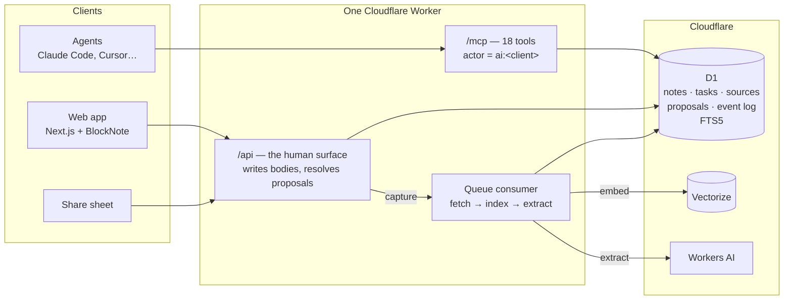

# et al.

[](https://github.com/daniellehonn/et-al/actions/workflows/ci.yml)

**A knowledge base you own, that AI agents work in — and can only suggest changes to.**

Agents connect over [MCP](https://modelcontextprotocol.io) and do real work:
capture links, file them, create notes and tasks. But anything that changes
what you *wrote* arrives as a proposal, with a diff, and nothing is real until
you accept it. Every write is signed by whoever made it.

`et al.` — "and others". Your notes, and the agents working alongside you.

## The trust model

| | Agents may do directly | Agents may only propose | Only you |
|---|---|---|---|
| **Notes** | create (empty), rename, move | any change to the body | accept or reject, delete |
| **Tasks** | create, update, delete | | |
| **Sources** | capture, file into a note | | |
| **Extracted insights** | | everything — they are proposals | keep or discard |

This is enforced by the shape of the system, not by convention:

- **The MCP surface has no tool that writes a note body**, resolves a proposal or
  deletes a note. Those exist only in the REST API the web app uses.
- **A proposal is a row in its own table**, not a flagged note. It is never
  indexed, so nothing unreviewed can surface in search or in the context an
  agent is given.
- **Authorship survives approval.** An accepted edit is written under the
  agent's name, block by block, and every edit keeps the version it replaced.
- **What you approve is exactly what gets written** — see below.

## How it works



One Worker serves the web app, the REST API, the MCP endpoint and a background
queue, on a single origin. The schema is one file:
[`migrations/0001_schema.sql`](migrations/0001_schema.sql).

## Engineering notes

**A preview that cannot lie.** Block edits run as a pure function from one body
to the next ([`src/store/body.ts`](src/store/body.ts)). Previewing a proposal
diffs that function's output against the current body (an LCS line diff);
accepting writes the same output by reconciling stored blocks by id. One code
path, so the diff a reviewer approves cannot drift from what lands — and a test
checks it, for rewrites and for granular insert / update / move ops. A patch
the note has moved on from is shown as stale instead of applied half-way.

**Hybrid search.** FTS5 keyword ranking and Vectorize semantic ranking are
fused with Reciprocal Rank Fusion ([`src/store/search.ts`](src/store/search.ts)):
rank-based, because BM25 and cosine scores aren't on comparable scales. The
vector arm is strictly additive — if it fails, search degrades to keywords.

**An extraction eval that found a real bug.** Saved links are read by Llama 3.3
on Workers AI, which proposes up to three durable facts per source.
[`npm run eval`](eval/) scores that against 20 fixtures. The first run showed
62% recall, with a third of substantive articles producing nothing; making the
extractor report *why* it returned nothing showed every empty result was
invalid JSON from the model. Switching to schema-constrained decoding took it to:

| recall | precision | facts invented from pages with nothing in them |
|---|---|---|
| 79–85% | 84% | 0 across 5 fixtures |

Full per-fixture results: [`eval/results/latest.md`](eval/results/latest.md).

**A capture pipeline that fails visibly.** Captures are idempotent
(`Idempotency-Key`, with a unique index to settle races), a link already in
the inbox isn't saved twice, a failed fetch records why and can be retried,
and the queue marks a source failed on its last attempt rather than leaving it
"pending" forever.

**Tests against the real runtime.** 93 tests run inside `workerd` with a real
D1 and every migration applied — no mocks of the runtime or the database. They
call `/api` and `/mcp` the way the app and agents do, so they survived a
rewrite of the whole data model. CI runs them on every push, `npm run deploy`
refuses to ship if they fail, and the app's `/test-suite` page shows the run
the deployed build was tested with.

The reasoning behind these, and what was cut to get here, is in the
[design log](docs/DESIGN.md).

## Connect an agent

```bash
claude mcp add --transport http et-al https://<your-worker>/mcp \
  --header "Authorization: Bearer $ET_AL_API_KEY" \
  --header "x-mcp-client: claude-code"
```

`x-mcp-client` becomes the actor on everything the agent writes. The tools are
listed in [`docs/MCP.md`](docs/MCP.md); the project's agent skills are in
[`.claude/skills/`](.claude/skills/).

## Run it

```bash
npm install
npx wrangler d1 migrations apply et-al --local
npm run dev                  # http://localhost:8787, key "dev-key" unless ET_AL_API_KEY is set
node scripts/seed.mjs        # optional: sample notes, tasks, links and proposals
npm test                     # 93 tests in workerd
npm run test:report          # the same, plus the report the /test-suite page shows
npm run eval                 # the extraction eval (calls Workers AI; needs wrangler login)
```

Deploying needs a D1 database, an R2 bucket, a queue, and a Vectorize index
(`--dimensions 768 --metric cosine`); the bindings are in
[`wrangler.toml`](wrangler.toml). `npm run deploy` refuses a dirty working tree.

## Layout

```text
src/
  index.ts      routing, auth, queue consumer
  api.ts        REST — the human surface
  mcp.ts        MCP — the agent surface, and the trust model by omission
  ingest.ts     fetch a link, read its metadata, index it, extract from it
  extract.ts    propose facts from a source (Workers AI, JSON-schema mode)
  store/        notes, blocks, body (pure), tasks, sources, proposals, search, context
client/         Next.js static export, served by the Worker
test/           Vitest in workerd
eval/           extraction fixtures, scorer, latest results
```
